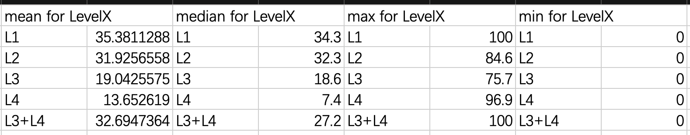
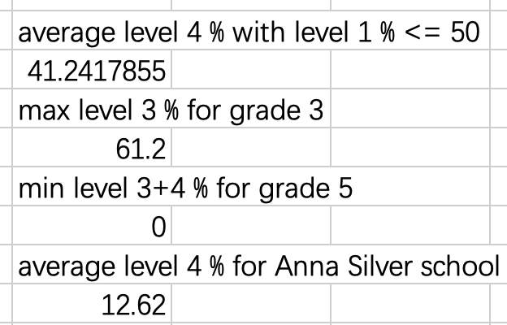
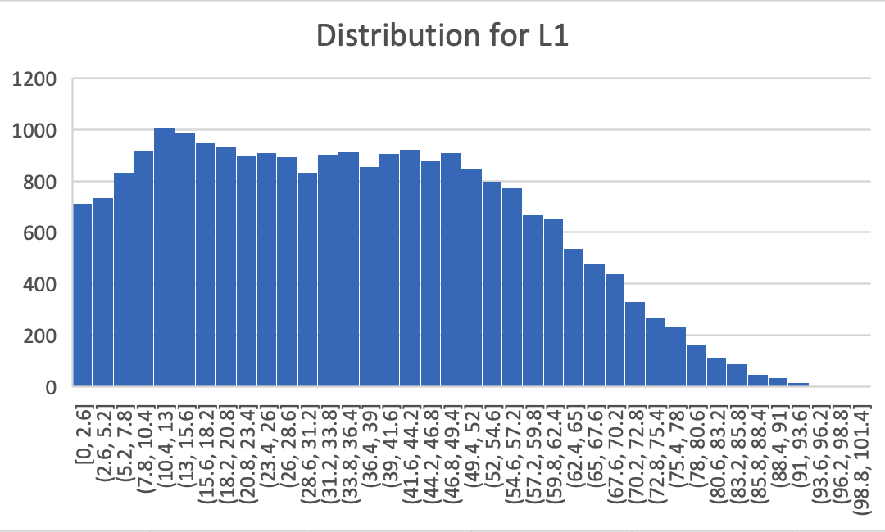
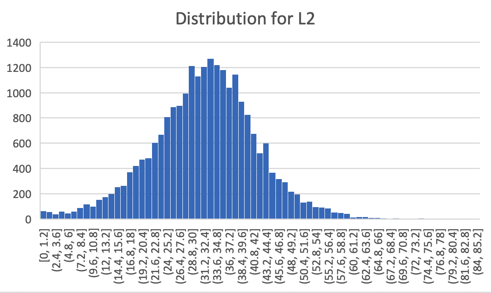
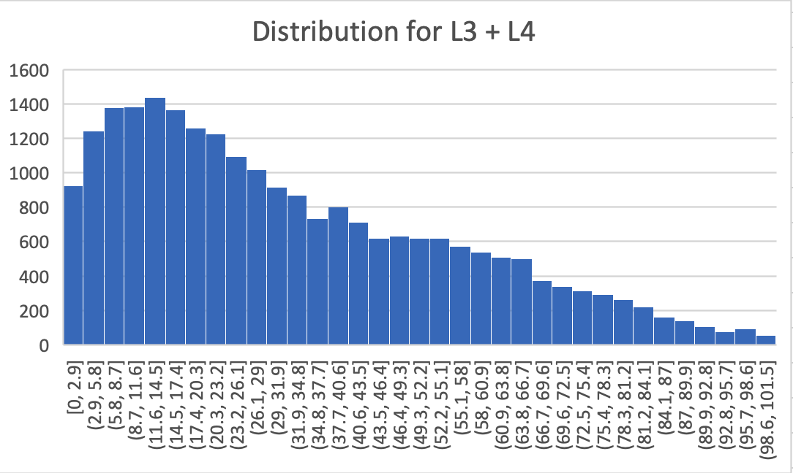

# Spreadsheet Analysis

## A general preview

This repository is about finding data, munging it, and analyzing it in a spreadsheet program.

The goals  are to:

- "scrub", "munge", or "clean" a datafile using Python 3
- import the text data file into an Microsoft Excel
- produce statistical results based on the data using the database-like functions in the spreadsheet program

## Data set details
    
I get the data of [2013-2017 School Math Results - All](https://data.cityofnewyork.us/Education/2013-2017-School-Math-Results-All/kha6-7i9i) from NYC Open. This csv file is saved into the data file.

The first 20 rows of the original data look like the following:
```
DBN,School Name,Grade,Year,Category,Number Tested,Mean Scale Score,Level1_N,Level1_%,Level2_N,Level2_%,Level3_N,Level3_%,Level4_N,Level4_%,Level3+4_N,Level3+4_%
01M015,PS 015 ROBERTO CLEMENTE,3,2013,All Students,27,278,16,59.3,11,40.7,0,0.0,0,0.0,0,0.0
01M015,PS 015 ROBERTO CLEMENTE,3,2014,All Students,18,286,6,33.3,9,50.0,2,11.1,1,5.6,3,16.7
01M015,PS 015 ROBERTO CLEMENTE,3,2015,All Students,17,280,10,58.8,4,23.5,2,11.8,1,5.9,3,17.6
01M015,PS 015 ROBERTO CLEMENTE,3,2016,All Students,21,275,13,61.9,4,19.0,4,19.0,0,0.0,4,19.0
01M015,PS 015 ROBERTO CLEMENTE,3,2017,All Students,29,302,8,27.6,9,31.0,7,24.1,5,17.2,12,41.4
01M015,PS 015 ROBERTO CLEMENTE,4,2013,All Students,20,277,12,60.0,6,30.0,1,5.0,1,5.0,2,10.0
01M015,PS 015 ROBERTO CLEMENTE,4,2014,All Students,24,282,9,37.5,14,58.3,1,4.2,0,0.0,1,4.2
01M015,PS 015 ROBERTO CLEMENTE,4,2015,All Students,17,281,8,47.1,7,41.2,2,11.8,0,0.0,2,11.8
01M015,PS 015 ROBERTO CLEMENTE,4,2016,All Students,15,304,3,20.0,7,46.7,3,20.0,2,13.3,5,33.3
01M015,PS 015 ROBERTO CLEMENTE,4,2017,All Students,23,301,6,26.1,8,34.8,8,34.8,1,4.3,9,39.1
01M015,PS 015 ROBERTO CLEMENTE,5,2013,All Students,24,274,17,70.8,6,25.0,1,4.2,0,0.0,1,4.2
01M015,PS 015 ROBERTO CLEMENTE,5,2014,All Students,21,266,17,81.0,2,9.5,1,4.8,1,4.8,2,9.5
01M015,PS 015 ROBERTO CLEMENTE,5,2015,All Students,24,275,16,66.7,6,25.0,2,8.3,0,0.0,2,8.3
01M015,PS 015 ROBERTO CLEMENTE,5,2016,All Students,16,283,7,43.8,7,43.8,2,12.5,0,0.0,2,12.5
01M015,PS 015 ROBERTO CLEMENTE,5,2017,All Students,17,322,2,11.8,5,29.4,8,47.1,2,11.8,10,58.8
01M015,PS 015 ROBERTO CLEMENTE,All Grades,2013,All Students,71,276,45,63.4,23,32.4,2,2.8,1,1.4,3,4.2
01M015,PS 015 ROBERTO CLEMENTE,All Grades,2014,All Students,63,278,32,50.8,25,39.7,4,6.3,2,3.2,6,9.5
01M015,PS 015 ROBERTO CLEMENTE,All Grades,2015,All Students,58,278,34,58.6,17,29.3,6,10.3,1,1.7,7,12.1
01M015,PS 015 ROBERTO CLEMENTE,All Grades,2016,All Students,52,286,23,44.2,18,34.6,9,17.3,2,3.8,11,21.2
```

There are few problems with this dataset although it has over 20K rows. It is nicely formatted and there is no null value in it. A minor problem with this dataset is that it contains observations that are calculated with few number of tests, so I perform row-wise removal of data with less than 20 tests.

## Analysis

I calculated mean, median, max and min percentage for all student math levels:



It appears that the overall distribution for student math level is a pyramid shape, with level 1 at the bottom and level 4 at the top. As the level increases, there are less percentage of students. There are also significant difference between schools given the gap between max and min are so huge across all math level. 

I also calculated four statistics each with a different criteria:



For those schools with the percentage of level 1 less than 50%, the average percentage for level 4 is about 41.24%. It is higher than the expected 25%, and we might further looking into it using correlation analysis.

For third grade students, the max percentage for level 3 is about 61.2%. This represents the most extreme outlier for grade 3 students with respect to level 3.

For fifth grade students, the min percentage of level 3 plus level 4 students is 0%. This is a surprisingly low outlier. ALtogether with the previous outlier statistics, it seems to indicate that there's still a huge gap in education, specifically education in math.

If we look at specific school, and in this case I choose Anna Silver school, its average level 4 percentage is only about 12.62%. It shows this school might need harder work in improving their math education.

The graph for distribution of different level percentage is shown below:  







The distribution for Level 1 is somewhat uniform for percentage below 50%. Beyond that point, there's a linear decrease in percentage. The distribution for Level 2 is bell shape and nearly normal distributed, with its mean at approximately 30%. The distribution for level 3 + 4 shows a right-skewed bell-shaped distribution. This makes total sense as most schools have about 10% of high level students, yet for those with better education resources, they are capable to have higher percentage of top students.

